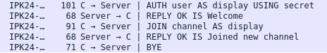
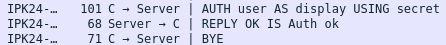
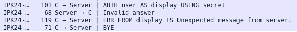
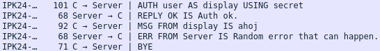
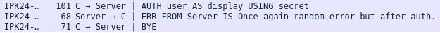

# IPK CHAT CLIENT

## Základní informace
Cílem programu je schopnost komunikace uživatele s ostatními uživateli prostředníctvím serveru, který podporuje komunikace přes protokol TCP nebo UDP.

### Spuštění
```
./ipk24chat-client <-h> -t <udp/tcp> -s <IP/hostname> <-p> <port> <-d> <timeout> <-r> <retransmission>
```
Kde:
- h - Vypíše jak spustit program.
- Port - značí port pro daný server kam se máme připojit. (Základní: 4567)
- Timeout - značí časový limit pro "confirm" zprávy od serveru. (Základní: 250ms)
- Retransmission - značí počet pokusů o poslání zprávy pro server pokud nedostaneme potvrzení v časovém limitu (Základní: 3)

### Použití
Na začátku je nutné převést autentifikaci na daný server s použitím příkazu
```
/auth <UserName> <Secret> <Display Name>
```
Po úspešné autentifikaci je možné začít komunikovat s ostatními uživateli na serveru. Aplikace také nabízí více možností které jsou možné zobrazením `/help`. Mezi základní funkcionality patří příkazy jako je `/rename <new name>`, `/join <channel>`.
Spojení se dá ukončít pomocí stistknutí kláves `CTRL + C` nebo `CTRL + D`. V prvním případě, aplikace čeká minimální čas (1.5s), aby se všechny zprávy ze strany servera dali správně zpracovat, a pak se ukončí.

V případě že nastala chyba na straně serveru, nebo samotné aplikace, program končí s informující chybovou hláškou a nenulovým návratovým kódem. 

### Použité nástroje
- IDE - VSCode
- OS - WSL2 Ubuntu, Referenční VM pro částeční debug a testování
- Částečné generování šablony pro doxygen komentáře pomocí Github Copilot
- Debug pomocí [Wireshark](https://www.wireshark.org/download.html), netcat, tcpdump
- Pomocný návod na [Beej's guide](https://beej.us/guide/bgnet/html/#getaddrinfoprepare-to-launch)

## Teorie

### TCP
TCP protokol je protokol pro spolehlivou komunikaci v síti. Zajišťuje, že data dorazí ve správném pořadí a bez chyb díky potvrzování přijetí a opětovnému odesílání ztracených částí. Jeho hlavní vyhodou je jak již zmíněno, že zabezpečí doručení všech odeslaných paketů. Také umožňuje rozdělovat data pro více aplikací.

### UDP
Je to protokol transportní vrsty, který narozdíl od TCP, nezajišťuje pořadí a ani přijetí odelasných paketů. Pořadí, přijetí a vícenásobné přijetí jsou problémy, které je potřeba řešit při implementaci tohodle protokolu. Jeho data se posílají v binární formě.

### Soket
Soket je koncový bod pro komunikaci mezi dvěma programy běžícími v síti. Umožňuje otevírání spojení, posílání a přijímání dat.

## Struktura projektu
Projekt je rozdělen do více částí (souborů), který pomahájí se orientovat. Hlavní část programu se nachází v souboru `main.cpp`, který řídí spojování ostatních tříd, které jsou rozděleny podle funkcionality.

### TCP
V případě spouštějícího argumentu "tcp", se program začne chovat dle protokolu TCP, kde jako první si naváže spojení s cílovým serverem pro komunikaci a až potom se začnou zasílat zprávy.. Tento protokol je více spolehliví jako UDP, takže aplikace se nezabívá s možnosti že jednotlivé zprávy nejsou doručeny. Funguje na principu předem napsané gramatiky, o kterou se už uživatel nemusí zajímat a stačí používat předepsané příkazy a posílání zpráv. Asynchronné posílání a příjmání zpráv je umožněno pomocí funkce `select`, a pomocí implementovaného konečného automatu (více informací níže). Při posílání TCP zpráv se využívá funkce `handleSend`, která zaručí správné naformátování dané zprávy pro odeslání a při nesprávném použití aplikace informuje uživatele o chybě která se nastala při odesílání. Pro příjmání zprávy se využívá funkce `handleReceive`, která zavolá náležíte funkce pro vyřešení výpisu pro uživatele, nebo informuje aplikaci o chybě a ukončí se.

### UDP
Pro protokol UDP se prvně vytvoří socket a poté pomocí funkce `select`, se zase zavolají funkce pro příjmání (`handleUDPrecv`) a odesílání (`handleUDPsend`) zpráv. Funkce pro odesílání a přijimání zpráv zase zaručí správné formátování jednotlivých přikazů nebo příchozích zpráv od serveru, a v případě chyby dojde k informování uživatele. Na rozdíl od TCP, UDP není až tak spolehlivý, tak musíme počítat se zprávy typu "confirm", které nám udávají, že server úspěsně obdržel naši zprávu. Pokud zprávu "confirm" nedostaneme v času daném od uživatele při spustení programu (nebo bereme základní čas nastavený v programu), tak musíme zprávu odeslat znovu, dokud nebude přijat serverem. `handleUDPrecv` zaručí poslání přijmuté zprávý ihned před jeho zpracováním, takže nemůže dojít k tomu, že během komunikace by se nějaká zpráva nebyla potvrzena. V opačném případě se aplikace pokusí zprávu odeslat `Retransmission`-krát. Při poslání zprávy UDP protokolem, daná funkce taktéž zabezpečí uchování času ve kterém byla poslána. V neúspěchu zprávu doručit, aplikace skončí. Pokud nějaká zpráva má spoždění, a potom se doručí vícekrát, zpráva by se měla zpracovat jenom jednou, přičemž odeslány potvrzujíci zprávy na všechny přijaté, ikdyž některé už máme zpracované.

V případě že došlo k chybě, aplikace ukončí svojí činnost s chybovou hláškou, kterou buď obdržel od serveru, nebo vygenerovala na základě interní chyby.

### Rozdělení aplikace podle tříd
#### Parser
Slouží na přijimání jednotlivých argumentů, se kterými byl program spouštěn. Když nějaké nepovinné argumenty nebyli součástí spuštění, tak je parser automaticky nastaví na základní hodnoty, se kterými bude program dále pokračovat. V případě argumentu `-h`, vypíše pomocnou zprávu jak program správně spouštět.
Při chybějící částí argumentů jako je IP adresa, hostname, nebo typ protokolu, program vypíše chybovou hlášku a ukončí se.

#### FSM
Konečný automat má pět stavů, a to: `START`, `AUTH`, `OPEN`, `REPLY`, `ERR`. Je implementován ve dvou funkcí, a to v `handleMessage` a `ErrMessageCheck`. Druhá funkce slouží na hlídání zpráv ze strany servera, jestli v daném stavu můžeme očekávat daný typ zprávy nebo nikoliv. Pokud zpráva není očekávaná v daném stavu, stav konečného automatu se nastaví na `ERR` a funkce `handleMessage` vypíše chybovou hlášku, kterou potom hlavní část programu taktéž pošle serveru a aplikace terminuje.

`handleMessage` hlídá zprávy a příkazy ze strany uživatele jestli je možnost je v daném stavu posílat nebo ne. V případě neplatného příkazu v daný moment, aplikace upozorní uživatele že to úkol není možné provést v daný moment. Dalším úkolem funkce je nastavování práv pro aplikaci posílat zprávy ze standardního vstupu pro server. V případě stavu `START`, uživateli je možno provést jenom příkaz `/auth`, na kterou je očekávaná odpověd ze strany serveru. Dokud uživatel nedostane pozitivní nebo negativní zprávu od serveru ve stavu `AUTH`, může předávat aplikaci více příkazů a zpráv, které se zpracují jenom po obdržení odpovědi. Tohle čekání je taktéž implementováno ve stavu `REPLY`, kde uživatel se dostane po zaslání příkazu `/join`, který musí obdržet odpověď.

V případě obdržení nechtěné odpovědi typu `reply ok/nok` od serveru, konečný automat to ignoruje a tak se to nevypíše. Když se konečný automat dostane do stavu `ERR` způsobeno předchozí funkcí, tak má dvě možnosti. Buď jsme již obdrželi terminujíci zprávu ze strany serveru a tak neodpovídáme a aplikace se ukončí po správném uvolnění použitých zdrojů, nebo vypíše chybovou hlášku neočekávané zprávy a ukončí se.

Konečný automat taktéž hlídá blokování standardního vsstupu pomocí proměnné typu bool `waitingForSend`, který je nastavený na hodnotu `true` jenom v případě kdy program může předávat zprávy serverovi na zpracování. Při ukončení aplikace, funkce `isWaitingForReply` ještě navíc hlídá aby všechny předané zprávy byly vyřízeny a aplikace se mohla správně ukončit bez problémů.

#### TCP
Třída `TCP` slouží jako abstrakce pro `main.cpp` při práci s daným protokolem. Obsahuje funkce:
`connectToServer` - pomocí pomocné funkce `getaddrinfo` vyhledá DNS pro hostname. Vytvoří sokeet, který si uchová aby k němu byl přístup i mimo dané třídy. Poté se pokusí navázat spojení se serverem, a vpřípadě úspěchu se připojí. Pokud dojde k chybě, uvolní všechny zdroje a aplikace se ukončí s chybovou hláškou.

`receiveData` - funkce načítá data bajt po bajtu, přičemž hledá CRLF sekvenci na konci dané zprávy. V případě neúspěchu přijímat data, vypíše chybovou hlášku a zpátky předá řízení funkci `handleReceive`, který dokáže správně zpracovat dané výsledky.

`sendData` - odesílá naformátovaný řetězec pro server, takže se stará už jenom o to, jestli je soket validní a jestli dojde k chybě při odesílání. Vždy dostane správně formátovanou zprávu, kterou má odeslat.

`sendByeMessage` - odešle dle správné gramatiky `BYE\r\n` zprávu serveru, značící ukončení spojení.

`gracefulShutdown` - využívá funkci `sendByeMessage` a zavírá TCP soket.

#### UDP
Narozdíl od `TCP` protokolu, tady o nás server neví dokud nepošleme první zprávu ikdyž daný soket už máme vytvořený. V případě neinicializované adresy serveru (značí boolová proměnná), se získá DNS pro hostname a zapíše se do struktury. Při druhém pokusu odesílání, se už zprávy odesílají bez další inicializace. Při přijimání zpráv, funkce hlídá jestli dostáváme zprávy ze správné adresy a pokud ne, zareaguje chybovou hláškou. Taktéž uchovává port ze kterého jsme danou zprávu dostali, abychom na něho v další zprávě mohli odpovědět na stejný port. Pokud se zpráva již objevila (má stejný message ID jako předchozí v komunikaci), na zprávu se pošle `confirm`, ale jinak je ignorováná kvůli možnosti zduplikovaného paketu. Pokud zpráva není duplikátem, jeho `message ID` se uchová pro poslání potvrzujíci zprávy, a taktéž pro budoucé kontroly.

#### LastMessage
Slouží na kontrolování, jestli nám dorazila potvrzující zpráva od serveru a na odesílání dané zprávy ještě tolikkrát, kolik je určeno na začátku programu (zase v případě neurčení, základní 3). Funkce taktéž hlídá časový interval, kdy byla zpráva poslána a kdy je nutné přeposlat ještě jednou. Pokud přesáhneme počet znovu poslání, program vypíše chybovou hlášku a ukončí se.

#### Commands
Třída sloužící na spolupráci mezi formátováním jednotlivých příkazů a hlavní částí programu pro odesílání. Rozděluje se na dvě funkce, jeden pracující pro TCP a jeden pro UDP protokol. Obě varianty v téhle třídě dělají přesně to stejné, a to volají dané funkce z třídy `TextFormatter` pro správné naformátování jednotlivých příkazů daného protokolu, který pak může využít `handleReceived` nebo `handleUDPrecv` v souboru `main`. V případě neznámého příkazu vypíše pro uživatele informující chybovou hlášku, že daný příkaz neexistuje.

#### TextFormatter
Třída formátuje zprávy pro obě varianty protokolů. Úzce spolupracuje s třídama `Strings` a `Validator`, které mu pomáhají ve správném formátování jednotlivých zprav, ať už jsou odeslané nebo příjmané. Třída taktéž uchovává předchozí a současné `Display name`, pod kterým posíláme zprávy.

Pro TCP variantu, se zavolá funkce `formatTCPcommand`, který spolupracuje s funkcemi `handleAuthCommand`, `handleJoinCommand`, `handleRenameCommand`. Tyhle funkce prvně rozdělí danou zprávu na slova, a zkontrolují syntaktickou správnost. Pokud všechno proběhne vpořádku, funkce `formatTCPcommand` správně naformátuje zprávu podle TCP gramatiky, kterou potom ulouží do proměnné `formattedText`, do které mají přístup ostatní funkce a třídy pro získání správného textu. Pro formátování příchozích zpráv slouží funkce `formatRecv`, která správně zformátuje příchozí zprávu a vypíše ho na správný výstup programu. V případě odesílané chyby se ještě používá funkce `formatError`.

UDP varianta zavolá funkci `formatUDPcommand`, který navíc od výše zmíněných funkcí pro příkazy, spolupracuje ještě s funkcí `setupUDP`, která slouží pro nastavení správného začátku a čísla zprávy kterou odesíláme. Pro formátování zpráv od serveru slouží funkce `formatUDPrecv`, která získáním prvého bajtu adresy naformátuje zprávu dle potřeby a vypíše ji na správný výstup. U formátování chybových hlášek odeslané aplikací, program volá funkci `formatUDPerror`.

#### Validator
Slouží na kontrolu, a případný výpis chybové hlášky, jednotlivých argumentů příkazů od uživatele. Funkce kontrolují délku, jednotlivé písmena a počet slov v daném příkazu aby se zajistilo správné odeslání. V případě chyby se chybová hláška vypíše pro uživatele, a návratové kódy naznačí hlavním funkcím `handleSend` nebo `handleUDPsend` aby se zpráva ignorovala a neodesílala pro server.

#### Strings
Třída obsahuje 5 funkcí, které doplňují a ulehčují základní funkce s řetězci:
`getWord` - vrací slovo v řetězci na pozici, která je požadovaná.
`split` - rozděluje řetězec na slova a vrací je jako vektor.
`toUpperCase` - změní všechny písmena v řetězci na veliká. Slouží jako pomůcka při case-insensitive implementaci TCP gramatiky.
`wordCount` - vrací počet slov v daném rětězci, slouží pro kontrolu syntaxi příkazů od uživatele.
`splitMessageParts`- slouží jako výpomoc při formátování UDP zpráv a chybových zpráv od serveru, protože odděluje jméno toho, kdo to poslal, a zprávu.

Všechny víš definované funkce spolupracují s třído TextFormatter a Validator, pro správné výstupný zprávy aplikace.

## Testování
Platforma: `Ubuntu WSL`
Použité nástroje: `netcat`, `Wireshark`

### Testy pro TCP
Testy pro `TCP` protokol probíhali přes software `netcat`, kde se na místě serveru odpovídalo manuálně, dle odpovědí získaných z referenčního serveru `anton5.fit.vutbr.cz`.

Postup při připojení se na `netcat` server:
- Spuštění serveru dle specifikace zadání: `nc -4 -C -l -v 127.0.0.1 4567 -k`
- Připojení se ze strany uživatele přes: `./ipk24chat-client -t tcp -s 127.0.0.1 < inputfile`,
kde: `inputfile` obsahuje všechny příkazy zadané uživatelem.

#### 1. Test na nesprávné použití začátku připojení (použití `/join` před `/auth`):
Vstup: 
```
/join channel
/auth user secret display
/join channel
```
Očekávaný výstup:
```
ERR: Invalid command, try using /help.
Success: Welcome
Success: Joined new channel
```
Výstup:
```
ERR: Invalid command, try using /help.
Success: Welcome
Success: Joined new channel
```


#### 2. Test na správnou autentifikaci:
Vstup: 
```
/auth user secret display
```
Očekávaný výstup:
```
Success: Auth ok
```
Výstup:
```
Success: Auth ok
```


#### 3. Test na jiný port než ten základní:
`netcat` spouštění: `nc -4 -C -l -v 127.0.0.1 1111 -k`
Spouštění klienta: `./ipk24chat-client -t tcp -s 127.0.0.1 -p 1111 < inputfile`

Vstup: 
```
/auth user secret display
```
Očekávaný výstup:
```
Success: Auth ok
```
Výstup:
```
Success: Auth ok
```


#### 4. Test na neznámou zprávu ze strany serveru:
Vstup: 
```
/auth user secret display
```
Odpověď serveru:
```
Invalid answer
```
Očekávaný výstup:
```
ERR: Unexpected message from server.
```
Výstup:
```
ERR: Unexpected message from server.
```


#### 5. Test na obdržení chybové zprávy od serveru ve stavu `OPEN`:
Vstup: 
```
/auth user secret display
ahoj
```
Očekávaný výstup:
```
Success: Auth ok.
ERR FROM Server: Random error that can happen.
```
Výstup:
```
Success: Auth ok.
ERR FROM Server: Random error that can happen.
```


#### 6. Test na obdržení chybové zprávy od serveru ve stavu `AUTH`:
Vstup: 
```
/auth user secret display
```
Očekávaný výstup:
```
ERR FROM Server: Once again random error but after auth.
```
Výstup:
```
ERR FROM Server: Once again random error but after auth.
```


### Testy pro UDP

 Testy pro protokol `UDP` probíhaly se stejnými vstupy jako u `TCP`, s jediným rozdílem u místa testování. Jelikož protokol `UDP` je těžší na testování přes pseudoservery, protože zprávy jsou posílané binárně, tak jsem se rozhodl využít zpřístupněný refereční server ze zadání projektu.
 Spouštění klienta: `/ipk24chat-client -t udp -s anton5.fit.vutbr.cz < inputfile`

 Hlavním cílem testování `UDP` protokolu bylo v rozdílech mezi předchozím protokolem. Což zahrňuje čekání na potvrzujíci zprávy `confirm` ze strany serveru před posíláním dalších příkazů. Jelikož referenční server očekával `confirm` odpovědi i z našé strany, tyhle zprávy byli automaticky kontrolované při snaze se správně připojit na server. Vynucení zpožděných dat ze strany serveru bylo více obtížné, tak se klient musel spustit z navíc parametrem `-d 0`, což způsobil 0ms timeout na očekávající zprávy, takže server nedokázal odpovědět včas a tak testován chování klienta při neobdržení potvrzující zprávy při čekání.

 Příjimání stejných zpráv vícekrát bylo testováno pomocí sníženého timeout času na 125ms, přes příkaz `-d 125`, což způsobilo že jsme dostávali i potvrzující zprávy, ale až po druhé nebo třetí zprávě.

 Pro `messageID` se do vstupního souboru přidalo více příkazů na zaslání serveru, abychom viděli jestli se to inkrementuje správně a zůstane unikátní, což taktéž vpořádku uspělo.

## Bibliografie

[Beej's guide] Hall, B. J. Beej's Guide to Network Programming: Using Internet Sockets. Elektronická kniha. v3.1.11. 2023. [Online]. Dostupné z: https://beej.us/guide/bgnet/html/ [citováno dne 31.3.2024]. Bez omezení přístupu.

[Copilot] GitHub. GitHub Copilot. 2023. [Online]. Dostupné z: https://github.com/features/copilot [citováno dne 31.3.2024]. Bez omezení přístupu.

[TCP] Wikipedie, o. s. (2024). Transmission Control Protocol. [Online]. Dostupné z: https://cs.wikipedia.org/wiki/Transmission_Control_Protocol [citováno dne 31.3.2024]. Bez omezení přístupu.

[UDP] Neznámý autor. Protokol UDP 1. část. Elektronický dokument. Builder.cz - Informační server o programování. 3. února 2003. [Online]. Dostupné z: https://www.builder.cz/rubriky/c/c--/protokol-udp-1-cast-156226cz [citováno dne 31.3.2024]. Bez omezení přístupu.

[SOKET] Wikipedie, o. s. (2021). Soket. [Online]. Dostupné z: https://cs.wikipedia.org/wiki/Soket [citováno dne 31.3.2024]. Bez omezení přístupu.

Postel, J. (1981). Transmission Control Protocol. RFC 793. [Online]. Dostupné z: https://datatracker.ietf.org/doc/html/rfc793 [citováno dne 31.3.2024]. Bez omezení přístupu.

Eddy, W. (2022). Transmission Control Protocol. RFC 9293. [Online]. Dostupné z: https://datatracker.ietf.org/doc/html/rfc9293 [citováno dne 31.3.2024]. Bez omezení přístupu.
